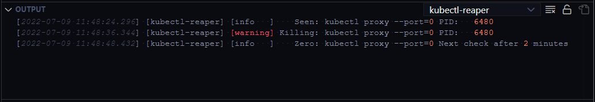

# vscode-kubernetes-kubectl-ripper README

The ```vscode-kubernetes-tools``` extension leaves ```kubectl proxy --port=0``` processes around [(See Issue)](https://github.com/vscode-kubernetes-tools/vscode-kubernetes-tools/issues/997). This prevents deletion or renaming of folders from which the ```kubectl``` process was run from. This extension takes care of this by reaping these leftover processes (with command line ```kubectl proxy --port=0```) if they are around for more than 5 seconds. Please use this extension carefully.

## Features

Reap ```kubectl --proxy --port=0``` after 5 seconds. The message about the killed ```kubectl``` PIDs is logged in the ```kubectl-reaper``` output channel. If no ```kubectl --proxy --port=0``` processes are found then check every 2 minute (120000 milliseconds i.e. backoff).



## Requirements

Requires vscode-kubernetes-tools extension.

## Extension Settings


## Known Issues


## Release Notes


### 1.0.17

